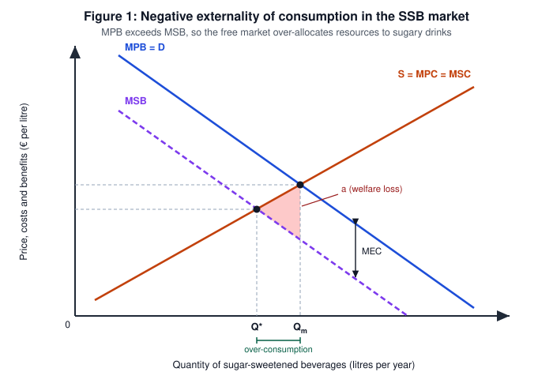
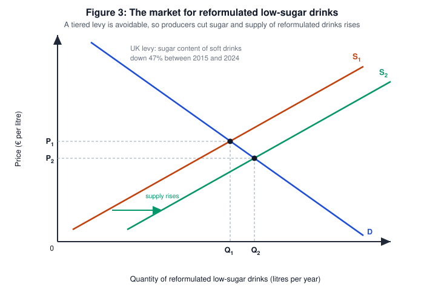

# Economics Internal Assessment — Commentary

| | |
|---|---|
| **Title of article** | Germany renews push for sugar tax and energy drinks ban for children |
| **Source** | Reuters (Maria Martinez) — https://www.reuters.com/business/healthcare-pharmaceuticals/germany-renews-push-sugar-tax-energy-drinks-ban-children-2026-03-25/ |
| **Date article published** | 25 March 2026 |
| **Date commentary written** | 18 September 2026 |
| **Section of the syllabus** | Unit 2 — Microeconomics |
| **Key concept** | Intervention |
| **Word count** | 800 |

> **Research question:** To what extent would a sugar tax on sugar-sweetened beverages improve market outcomes in Germany?

---

## Commentary

With the economic problem of unlimited wants but limited resources, societies rely on markets to allocate resources efficiently, yet where markets fail this is corrected through government **intervention**. **Intervention** refers to government action that changes a market outcome to correct market failure, a misallocation in which a free market fails to achieve allocative efficiency. Because **intervention** alters the incentives of consumers and producers alike, one measure may change behaviour on both sides of a market. In this article, **intervention** is seen as Germany proposes a tax on sugar-sweetened beverages and bans energy-drink sales to under-16s, thus forcing producers to reconsider their recipes. However, there are consequences upon intervening, as the measure may burden parties it was not intended to.

Sugar-sweetened beverages create a negative externality of consumption, as obesity and type-2 diabetes are treated through statutory health insurance funded by all contributors, making them demerit goods over-consumed partly because of information failure. On 27 March 2026 the Bundesrat voted on Schleswig-Holstein's proposal, which earmarked revenue for health initiatives but left its design open. The WHO reports more than 100 countries already tax sugary drinks, a Forsa survey found roughly 60% of Germans in favour, and a 2023 Technical University of Munich study modelled a UK-style levy as cutting daily sugar intake by 2–3 grams, preventing 244,000 type-2 diabetes cases and saving €16 billion over twenty years. **Figure 1**, **2** and **3** demonstrate the effects of the levy on the German market.

Greens lawmaker Johannes Wagner framed the case: "Anyone making profits from heavily sugared drinks must also contribute more to financing the resulting costs." In **Figure 1**, because consumers weigh only their private benefit, the market settles at Qm, where marginal private benefit equals marginal private cost, rather than at the social optimum Q*, where MSC equals MSB. The vertical distance between MPB and MSB represents the marginal external cost, and area a is the welfare loss caused by the over-consumption of Qm − Q*. Thus, without **intervention** the market would continue to over-allocate resources to sugary drinks.

A specific tax raises production costs at every output, shifting supply vertically from S₁ to S₂ in **Figure 2**, where the distance between the two curves represents the tax. The consumer price rises from P₁ to P₂ while producers retain only P₃, and quantity contracts from Qm to Q*, internalising the externality so that price reflects the full social cost. Government revenue is areas b + c, which the proposal would hypothecate to health programmes, consumers bearing area b and producers area c. Because these drinks have close substitutes such as water and sugar-free variants, demand is relatively price-elastic, so quantity falls appreciably and producers absorb a meaningful share.

Sabine Dittmar argued the levy should be tiered, taxing high-sugar drinks more heavily than lower-sugar alternatives, a design avoidable by intention. Daniel Guenther stated that "manufacturers should have an incentive to revise their recipes and reduce sugar content". In **Figure 3**, producers respond by reformulating, so supply of low-sugar drinks increases from S₁ to S₂, lowering price from P₁ to P₂ and raising quantity from Q₁ to Q₂. Under the UK levy this cut soft drinks' sugar content by 47%, and sugar intake falls without consumers buying fewer drinks. This two-sided response, in which a measure aimed at consumers is answered by producers, shows how **intervention** operates across a market.

It must also be noted that there were assumptions made in this model. Allocative efficiency requires the tax to equal the marginal external cost, yet no reliable estimate of that cost exists, so too high a rate would over-correct while too low a rate would leave area a intact. This raises the question of whether such a levy can be calibrated, and thus government failure remains possible.

The policy also introduces a risk of unintended consequences. Guenter Tissen of the sugar association warns a "punitive tax" may push manufacturers to "replace sugar with artificial sweeteners without improving public health", and that blaming one ingredient is unscientific. An example of this is when the levy corrects the price of sugar in drinks while leaving confectionery, juices and cross-border purchases untaxed, so consumers may simply substitute and the correction remains partial. The tax is also regressive, as low-income households spend a larger share of income on these drinks, although their demand is more elastic, so they capture most of the health gain.

A further concern is that the objectives conflict: successful reformulation shrinks the tax base, so the earmarked revenue falls exactly when the policy works best. Thus, a tiered levy would improve market outcomes to a significant extent, though chiefly by changing what producers supply rather than by pricing consumers out. Because the cause is partly information failure, this **intervention** works best alongside the under-16 ban, which reaches young consumers who respond weakly to price signals.

## References

1. Martinez, M. (25 March 2026) *Germany renews push for sugar tax and energy drinks ban for children.* Reuters. https://www.reuters.com/business/healthcare-pharmaceuticals/germany-renews-push-sugar-tax-energy-drinks-ban-children-2026-03-25/
2. Technical University of Munich (2023) modelling study, as reported in the article — 2–3 g lower daily sugar intake, up to 244,000 type-2 diabetes cases prevented and up to €16 billion saved over 20 years.
3. World Health Organization, as reported in the article — more than 100 countries tax sugary drinks, including about half of EU member states.
4. Forsa survey (February 2026), as reported in the article — about 60% of Germans support a levy on high-sugar soft drinks.
5. HM Treasury / UK Soft Drinks Industry Levy evidence — sales-weighted average sugar content of soft drinks down roughly 47% between 2015 and 2024, with most of the fall attributable to reformulation.

## Appendix: DEEDE structure (not part of the word count)

| Stage | Where it appears |
|---|---|
| **D — Definition** | Paragraph 1 defines intervention, market failure and allocative efficiency; paragraph 2 defines the negative externality of consumption, demerit goods and information failure; the remaining terms (marginal external cost, incidence, hypothecation, price elasticity, government failure) are defined on first use. |
| **E — Evidence** | Paragraph 2: the Bundesrat vote of 27 March 2026, earmarked revenue, the under-16 ban, the WHO's 100-plus countries, the Forsa 60% figure, and the TU Munich study's 2–3 g, 244,000 cases and €16 billion. |
| **E — Example** | Wagner's "must also contribute more to financing the resulting costs" (paragraph 3), Guenther's recipe-incentive rationale and Dittmar's tiered design (paragraph 5), Tissen's artificial-sweetener objection (paragraph 7), and the UK levy as the working precedent. |
| **D — Diagram** | **Figure 1** (externality: MPB above MSB, marginal external cost, welfare loss area a) → **Figure 2** (specific tax: S₁ to S₂, incidence areas b and c, Qm to Q*) → **Figure 3** (reformulation: supply of low-sugar drinks rises). |
| **E — Evaluation** | Paragraph 6 on calibrating the tax to the marginal external cost and government failure; paragraph 7 on artificial sweeteners, untaxed substitutes and regressive incidence; paragraph 8 on the revenue-versus-health conflict and the concluding judgement. |
