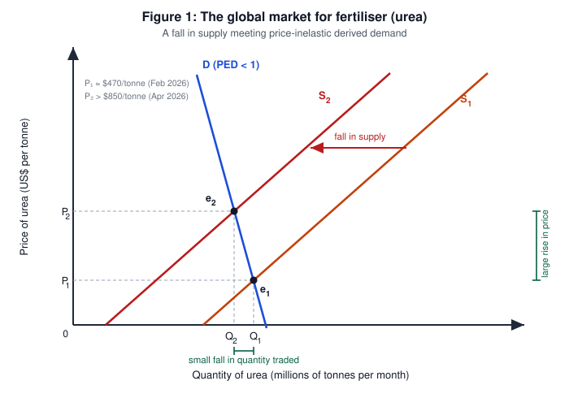
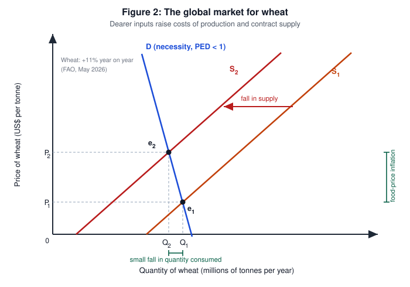
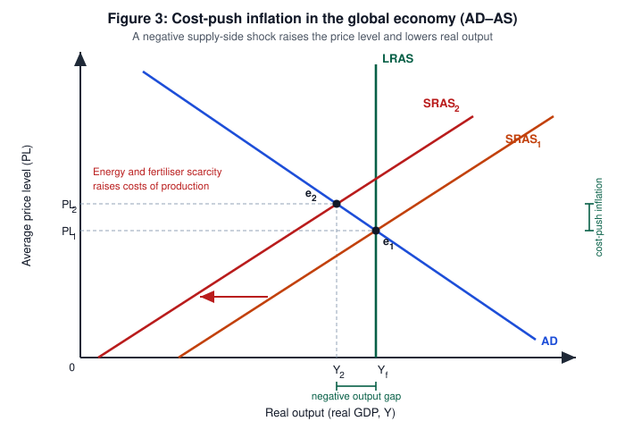

# Economics Internal Assessment — Commentary

| | |
|---|---|
| **Title of article** | As Iran crisis drags on, fears of global food catastrophe grow |
| **Source** | Al Jazeera — https://www.aljazeera.com/economy/2026/4/21/as-iran-crisis-drags-on-fears-of-global-food-crisis-grow |
| **Date article published** | 21 April 2026 |
| **Date commentary written** | 18 September 2026 |
| **Section of the syllabus** | Unit 3 — Macroeconomics |
| **Key concept** | Scarcity |
| **Word count** | 799 |

> **Research question:** To what extent will the scarcity of energy and fertiliser caused by disruptions to the Strait of Hormuz contribute to global food-price inflation?

---

## Commentary

With the economic problem of unlimited wants but limited resources, every economy must choose how to allocate what it has, which is the problem of **scarcity**. **Scarcity** refers to finite resources being insufficient to satisfy unlimited wants, forcing choice and imposing an opportunity cost on every decision. Because **scarcity** is relative, a resource becomes scarcer not only when destroyed but when access to it is blocked. In this article, **scarcity** is seen as Iran's closure of the Strait of Hormuz cuts off the energy and fertiliser farming depends on, thus forcing producers to operate with fewer factors of production. However, there are consequences upon relying on a single chokepoint, as cost pressures may spread from input markets into food prices worldwide.

The strait "normally carries about one-third of global seaborne fertiliser and one-quarter of seaborne oil", so its closure removes a large share of world supply. Brent crude rose from $61 to $118 a barrel in the first quarter of 2026 and urea passed $850 a tonne in April, an 80% rise in two months, while the World Bank projects fertiliser prices up more than 30% in 2026. The World Food Programme estimates 45 million more people could face acute food shortages if oil stays above $100. **Figure 1**, **2** and **3** demonstrate the effects of this input **scarcity**.

Natural gas is the principal variable cost of ammonia and urea, so energy **scarcity** and blocked shipping reinforce one another: Iran halted ammonia output and Qatar suspended urea production. In **Figure 1**, this reduces supply from S₁ to S₂, raising price from P₁ to P₂ while quantity traded falls only from Q₁ to Q₂. Because nitrogen has no substitute within a single planting season, this derived demand is price-inelastic, so the demand curve is steep and almost the whole adjustment is borne by price. Thus, farmers cannot escape the shortage by buying less.

Fertiliser, fuel and freight are farming inputs, so dearer inputs raise costs of production and contract supply in the wheat market from S₁ to S₂, as **Figure 2** shows. Food is a necessity with few substitutes, so demand is again inelastic and price rises proportionately more than quantity falls. Here the price mechanism rations the scarce fertiliser to the highest-value users, pricing poorer farmers out. Farmers also apply less fertiliser, lowering yields, and the FAO expects wheat, maize and rice output below 2025's records, shifting supply leftward next harvest. This transmission of shortage into higher prices elsewhere is how **scarcity** becomes food-price inflation.

Food and energy are heavily weighted in consumer price indices, so these microeconomic price rises aggregate. In **Figure 3**, the shock shifts short-run aggregate supply from SRAS₁ to SRAS₂, raising the average price level from PL₁ to PL₂ while real output falls from Yf to Y₂, opening a negative output gap. Inflation alongside falling real output is stagflation, and the IMF has raised its forecast for global headline inflation from 4.1% in 2025 to 4.7% in 2026, "driven mainly by higher energy and food prices". Thus, the **scarcity** of two inputs reduces welfare across every economy trading food.

The size of this effect rests on elasticity: low PED and low short-run price elasticity of supply mean price absorbs the shock, and energy enters every stage of the food chain, so the burden is economy-wide. The incidence is also regressive, since by Engel's law poor households spend a high proportion of income on food, and staple demand is income-inelastic. Matin Qaim predicts "poor people in Africa and Asia will be hurt the most", with India, Bangladesh, Sri Lanka, Somalia, Sudan, Tanzania, Kenya and Egypt most at risk.

It must also be noted that the model assumes the disruption persists. This raises the question of whether the full effect has been felt, as analysts agree the "true impact of the conflict has yet to be felt" given the time lag between input costs and retail prices. The FAO Food Price Index averaged only 130.7 points in April 2026, 2% above a year earlier, as good harvests and stocks cushioned consumers. Supply becomes more elastic over time as producers substitute manure, re-route to other suppliers and add capacity. An example of this is core inflation staying stable while headline inflation jumped, implying a change in relative prices rather than generalised inflation.

Attribution is also difficult, as weather, El Niño and export restrictions are confounding causes, making the closure necessary but insufficient. Thus, the contribution of this **scarcity** to global food-price inflation is significant but conditional on duration. If the strait reopens, the outcome is a one-off rise in the price level rather than sustained inflation, provided inflationary expectations stay anchored. If disruption continues through the 2026–27 planting season, the lagged yield effect would deliver a second, larger round of inflation, borne most heavily by low-income food-deficit countries.

## References

1. Al Jazeera (21 April 2026) *As Iran crisis drags on, fears of global food catastrophe grow.* https://www.aljazeera.com/economy/2026/4/21/as-iran-crisis-drags-on-fears-of-global-food-crisis-grow
2. FAO (April 2026) *FAO Chief Economist warns of severe global food security risks from disruption to Strait of Hormuz trade corridor*; *FAO Food Price Index*, April 2026 release (130.7 points).
3. World Bank (2026) *Fertilizer prices surge as Strait of Hormuz disruptions tighten supplies*, Data Blog — urea above $850/tonne in April 2026, +80% since February; fertiliser price index projected to rise by more than 30% in 2026.
4. IMF (July 2026) *World Economic Outlook Update* — global headline inflation 4.1% (2025) → 4.7% (2026) → 3.9% (2027).
5. World Food Programme (March 2026) analysis — up to 45 million additional people facing acute food shortages.
6. U.S. Energy Information Administration (2026) — Brent crude $61/b (January) to $118/b (end of Q1 2026).

## Appendix: DEEDE structure (not part of the word count)

| Stage | Where it appears |
|---|---|
| **D — Definition** | Paragraph 1 defines scarcity and opportunity cost and establishes it as the key concept; derived demand, price elasticity, the rationing function, cost-push inflation, stagflation and the negative output gap are defined on first use in paragraphs 3 to 5. |
| **E — Evidence** | Paragraph 2: the article's one-third of seaborne fertiliser and one-quarter of seaborne oil, Brent at $61 to $118, urea up 80% past $850 a tonne, the World Bank's 30% projection and the WFP's 45 million people. |
| **E — Example** | Paragraph 3: Iran's halt to ammonia output and Qatar's suspension of urea production; paragraph 4: the FAO's forecast of wheat, maize and rice output below 2025's records; paragraph 6: Matin Qaim and the named at-risk countries. |
| **D — Diagram** | **Figure 1** (fertiliser market: fall in supply against inelastic derived demand) → **Figure 2** (wheat market: input costs contract supply) → **Figure 3** (AD–AS: SRAS shift, cost-push inflation and a negative output gap). |
| **E — Evaluation** | Paragraph 6 on elasticities, the economy-wide reach of energy costs and regressive incidence via Engel's law; paragraph 7 on time lags, the subdued FAO index, rising PES over time and stable core inflation; paragraph 8 on confounding causes and the duration-conditional judgement. |
